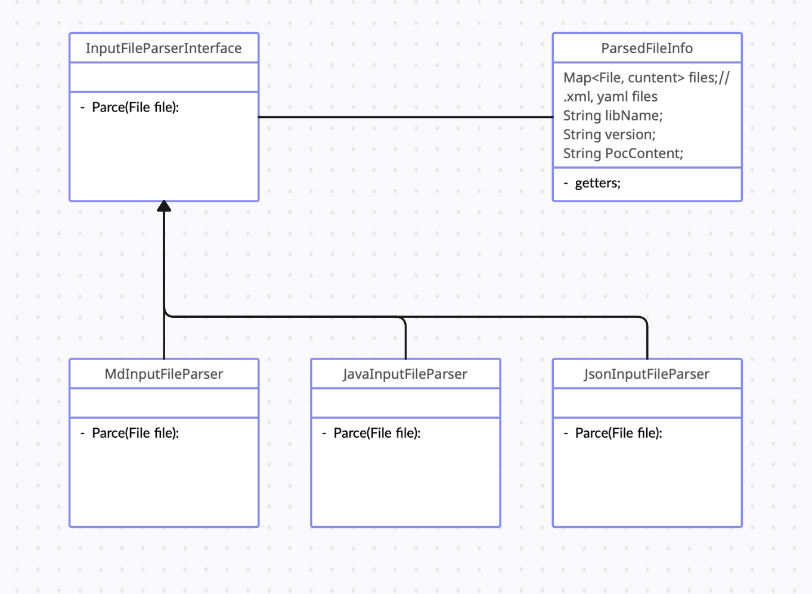

# PocAutoBuilder

## Архитектура Приложения

### Требования к приложению

 На вход приложению подаётся список md файлов (или же ссылок на них в гитхабе), каждый из которых должен содержать следующую информацию

- Название опасного пакета и номер его версии
- Сам эксплойт 
- Указание дополнительных файлов, необходимых для отработки эксплойта и их содержимое

TODO: продумать и для других случаев, к примеру, на вход попадают java, json файлы.

На выходе приложение отдаёт список проектов для каждого из эксплойтов, предварительно проверив их на запуск и отработку эксплойта. В проект входят:

- pom.xml файл с необходимыми зависимостями
- Main.java с методом main, запускающий эксплойт
- ещё какие-то файлы при надобности эксплойту.

В случае не составления проекта описывать ошибку, по которой он не смог собраться (не нашлась нужная версия пакета или зависимостей, присутствуют неизвестные символы и классы и т.п.)

### Процессы

Про каждый модуль отдельно:

### Парсер файлов и информацией об уязвимостях

TODO: выбрать конкретный способ работы с md файлами. Напрмер:

- https://github.com/commonmark/commonmark-java

### Создание доп файлов

Просто отдельный класс с созданием файлов в папке по переданной мапе.

### Нахождение зависимостей

Алгоритм: составляем url (согласно первому примеру отсюда https://central.sonatype.org/search/rest-api-guide/), полученный json парсим и извлекаем нужную информацию (groupId и artifactId). 

### Добавление импортов

TODO: понять, как это можно сделать (желательно эффективно, без добавления лишнего)

### Собирание эксплойта

Здесь имеется только 1 класс, который принимает все данные для Main.java и pom.xml, создаёт их, запускает через maven и запускает. Известные ошибки обрабатываются с откатом на нахождение новых уязвимостей и импотртов. 